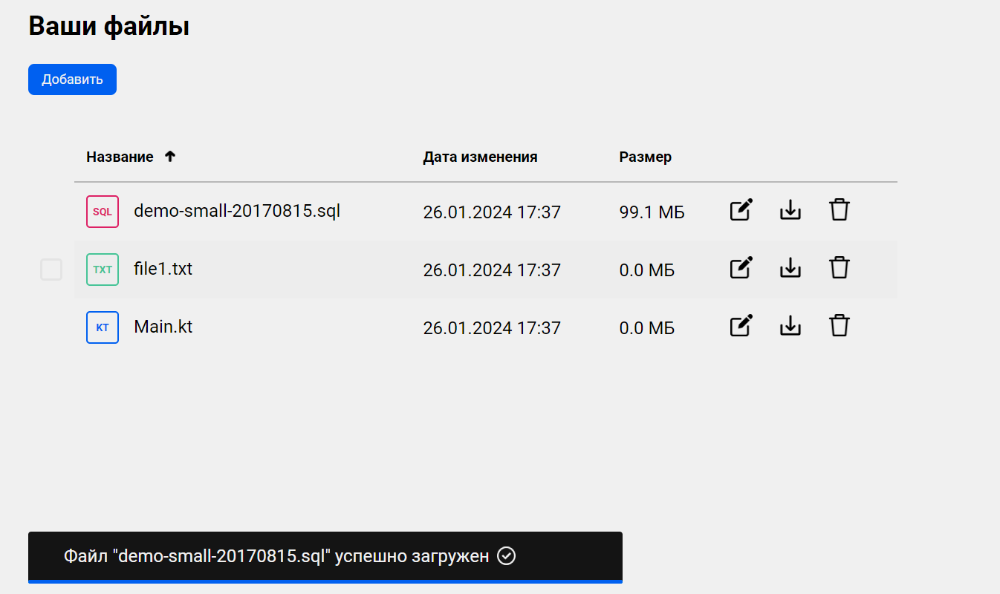

# Дипломная работа «Облачное хранилище»
## Описание проекта

Задача — разработать REST-сервис. Сервис должен предоставить REST-интерфейс для загрузки файлов и вывода списка уже загруженных файлов пользователя.

Данное приложение представляет собой серверную часть облачного хранилища для файлов.
Разработана на языке Java с помощью фреймворка Spring Boot.

### Описание серверной части

REST-сервис предоставляет интерфейс для возможности загрузки файлов и вывода списка уже загруженных файлов пользователя
по [заранее описанной спецификации](CloudStorage.yaml).

Все запросы к сервису авторизованы.

### Функционал серверной части
+ Отображение загруженных файлов;
+ загрузка файлов;
+ скачивание файлов;
+ удаление файлов;
+ смена имени файлов;
+ аутентификация и авторизация.

### Используемый стэк
+ Spring Boot;
+ Spring Security;
+ Maven;
+ Docker, Docker Compose;
+ PostgreSQL.

### Тесты
Для основных функциональных модулей написаны тесты с использованием:
+ JUnit;
+ Mockito;
+ TestContainers (интеграционные тесты).

## Запуск приложения

#### Авторизация приложения:
FRONT приложение использует header `auth-token` в котором отправляет токен (ключ-строка) для идентификации пользователя на BACKEND.
Для получения токена нужно пройти авторизацию на BACKEND и отправить на метод /login пару логин и пароль, в случае успешной проверки в ответ BACKEND должен вернуть json объект
с полем `auth-token` и значением токена. Все дальейшие запросы с FRONTEND, кроме метода /login отправляются с этим header.
Для выхода из приложения нужно вызвать метод BACKEND /logout, который удалит/деактивирует токен и последующие запросы с этим токеном будут не авторизованы и возвращать код 401.

### Учетные данные для входа
+ логин - alex, пароль - 1234.

## Описание и запуск FRONT
1. Установите nodejs (версия не ниже 19.7.0) на компьютер, следуя инструкции.
2. Скачайте [FRONT](https://github.com/netology-code/jd-homeworks/tree/master/diploma/netology-diplom-frontend) (JavaScript).
3. Перейдите в папку FRONT приложения и все команды для запуска выполняйте из неё.
4. Следуя описанию README.md FRONT проекта, запустите nodejs-приложение (npm install, npm run serve).
5. Далее нужно задать url для вызова своего backend-сервиса. 
      1. В файле .env FRONT (находится в корне проекта) приложения нужно изменить url до backend, например: VUE_APP_BASE_URL=http://localhost:8080.
           1. Нужно указать корневой url вашего backend, к нему frontend будет добавлять все пути согласно спецификации
           2. Для VUE_APP_BASE_URL=http://localhost:8080 при выполнении логина frontend вызовет http://localhost:8080/login
      2. Запустите FRONT снова: npm run serve.
      3. Изменённый url сохранится для следующих запусков.
6. По умолчанию FRONT запускается на порту 8080 и доступен по url в браузере http://localhost:8080.
7. Если порт 8080 занят, FRONT займёт следующий доступный (8081). После выполнения npm run serve в терминале вы увидите, на каком порту он запустился.

## Команда запуска и порт
Для запуска сервера нужно выполнить команды:
```
mvn install
```

И далее запустить проект командой:
```
docker-compose up
```

## Тестирование работы программы

/login


/file (post)


/file (get)


/file (put)


/file (delete)


/list

