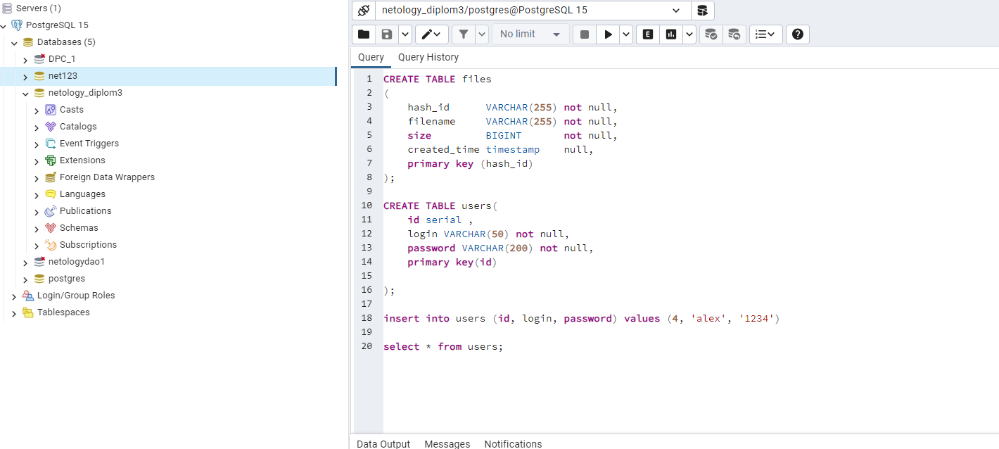

PS I:\Netology\DiplomCloudStorage\src\main\docker> docker-compose up                                              
[+] Building 0.0s (0/0)                                                                                                                                                                                                  docker:default
[+] Running 2/0
✔ Container db   Created                                                                                                                                                                                                          0.0s
✔ Container app  Created                                                                                                                                                                                                          0.0s
Attaching to app, db
db   |
db   | PostgreSQL Database directory appears to contain a database; Skipping initialization
db   |
db   | 2024-01-14 12:30:43.431 UTC [1] LOG:  starting PostgreSQL 15.4 (Debian 15.4-2.pgdg110+1) on x86_64-pc-linux-gnu, compiled by gcc (Debian 10.2.1-6) 10.2.1 20210110, 64-bit
db   | 2024-01-14 12:30:43.433 UTC [1] LOG:  listening on IPv4 address "0.0.0.0", port 5432
db   | 2024-01-14 12:30:43.433 UTC [1] LOG:  listening on IPv6 address "::", port 5432
db   | 2024-01-14 12:30:43.436 UTC [1] LOG:  listening on Unix socket "/var/run/postgresql/.s.PGSQL.5432"
db   | 2024-01-14 12:30:43.438 UTC [27] LOG:  database system was shut down at 2024-01-14 12:22:45 UTC
db   | 2024-01-14 12:30:43.448 UTC [1] LOG:  database system is ready to accept connections
app  |
app  |   .   ____          _            __ _ _
app  |  /\\ / ___'_ __ _ _(_)_ __  __ _ \ \ \ \
app  | ( ( )\___ | '_ | '_| | '_ \/ _` | \ \ \ \
app  |  \\/  ___)| |_)| | | | | || (_| |  ) ) ) )
app  |   '  |____| .__|_| |_|_| |_\__, | / / / /
app  |  =========|_|==============|___/=/_/_/_/
app  |  :: Spring Boot ::                (v2.7.0)
app  |
app  | 2024-01-14 12:30:44.917  INFO 1 --- [           main] ru.netology.CloudStorage                 : Starting CloudStorage v0.0.1-SNAPSHOT using Java 17.0.2 on 1d333f3eab7f with PID 1 (/myapp.jar started by root in /)
app  | 2024-01-14 12:30:44.922  INFO 1 --- [           main] ru.netology.CloudStorage                 : No active profile set, falling back to 1 default profile: "default"
app  | 2024-01-14 12:30:46.129  INFO 1 --- [           main] .s.d.r.c.RepositoryConfigurationDelegate : Bootstrapping Spring Data JPA repositories in DEFAULT mode.
app  | 2024-01-14 12:30:46.206  INFO 1 --- [           main] .s.d.r.c.RepositoryConfigurationDelegate : Finished Spring Data repository scanning in 60 ms. Found 1 JPA repository interfaces.
app  | 2024-01-14 12:30:47.350  INFO 1 --- [           main] o.s.b.w.embedded.tomcat.TomcatWebServer  : Tomcat initialized with port(s): 8080 (http)
app  | 2024-01-14 12:30:47.366  INFO 1 --- [           main] o.apache.catalina.core.StandardService   : Starting service [Tomcat]
app  | 2024-01-14 12:30:47.367  INFO 1 --- [           main] org.apache.catalina.core.StandardEngine  : Starting Servlet engine: [Apache Tomcat/9.0.63]
app  | 2024-01-14 12:30:47.479  INFO 1 --- [           main] o.a.c.c.C.[Tomcat].[localhost].[/]       : Initializing Spring embedded WebApplicationContext
app  | 2024-01-14 12:30:47.479  INFO 1 --- [           main] w.s.c.ServletWebServerApplicationContext : Root WebApplicationContext: initialization completed in 2475 ms
app  | 2024-01-14 12:30:48.181  INFO 1 --- [           main] o.hibernate.jpa.internal.util.LogHelper  : HHH000204: Processing PersistenceUnitInfo [name: default]
app  | 2024-01-14 12:30:48.234  INFO 1 --- [           main] org.hibernate.Version                    : HHH000412: Hibernate ORM core version 5.6.9.Final
app  | 2024-01-14 12:30:48.402  INFO 1 --- [           main] o.hibernate.annotations.common.Version   : HCANN000001: Hibernate Commons Annotations {5.1.2.Final}
app  | 2024-01-14 12:30:48.467  INFO 1 --- [           main] com.zaxxer.hikari.HikariDataSource       : HikariPool-1 - Starting...
db   | 2024-01-14 12:30:48.585 UTC [31] FATAL:  database "netology_diplom3" does not exist
app  | 2024-01-14 12:30:49.621 ERROR 1 --- [           main] com.zaxxer.hikari.pool.HikariPool        : HikariPool-1 - Exception during pool initialization.
app  |
app  | org.postgresql.util.PSQLException: FATAL: database "netology_diplom3" does not exist
app  |  at org.postgresql.core.v3.QueryExecutorImpl.receiveErrorResponse(QueryExecutorImpl.java:2675) ~[postgresql-42.3.5.jar!/:42.3.5]
app  |  at org.postgresql.core.v3.QueryExecutorImpl.readStartupMessages(QueryExecutorImpl.java:2787) ~[postgresql-42.3.5.jar!/:42.3.5]
app  |  at org.postgresql.core.v3.QueryExecutorImpl.<init>(QueryExecutorImpl.java:173) ~[postgresql-42.3.5.jar!/:42.3.5]
app  |  at org.postgresql.core.v3.ConnectionFactoryImpl.openConnectionImpl(ConnectionFactoryImpl.java:290) ~[postgresql-42.3.5.jar!/:42.3.5]
app  |  at org.postgresql.core.ConnectionFactory.openConnection(ConnectionFactory.java:49) ~[postgresql-42.3.5.jar!/:42.3.5]
app  |  at org.postgresql.jdbc.PgConnection.<init>(PgConnection.java:223) ~[postgresql-42.3.5.jar!/:42.3.5]
app  |  at org.postgresql.Driver.makeConnection(Driver.java:402) ~[postgresql-42.3.5.jar!/:42.3.5]
app  |  at org.postgresql.Driver.connect(Driver.java:261) ~[postgresql-42.3.5.jar!/:42.3.5]
app  |  at com.zaxxer.hikari.util.DriverDataSource.getConnection(DriverDataSource.java:138) ~[HikariCP-4.0.3.jar!/:na]
app  |  at com.zaxxer.hikari.pool.PoolBase.newConnection(PoolBase.java:364) ~[HikariCP-4.0.3.jar!/:na]
app  |  at com.zaxxer.hikari.pool.PoolBase.newPoolEntry(PoolBase.java:206) ~[HikariCP-4.0.3.jar!/:na]
app  |  at com.zaxxer.hikari.pool.HikariPool.createPoolEntry(HikariPool.java:476) ~[HikariCP-4.0.3.jar!/:na]
app  |  at com.zaxxer.hikari.pool.HikariPool.checkFailFast(HikariPool.java:561) ~[HikariCP-4.0.3.jar!/:na]
app  |  at com.zaxxer.hikari.pool.HikariPool.<init>(HikariPool.java:115) ~[HikariCP-4.0.3.jar!/:na]
app  |  at com.zaxxer.hikari.HikariDataSource.getConnection(HikariDataSource.java:112) ~[HikariCP-4.0.3.jar!/:na]
app  |  at org.hibernate.engine.jdbc.connections.internal.DatasourceConnectionProviderImpl.getConnection(DatasourceConnectionProviderImpl.java:122) ~[hibernate-core-5.6.9.Final.jar!/:5.6.9.Final]
app  |  at org.hibernate.engine.jdbc.env.internal.JdbcEnvironmentInitiator$ConnectionProviderJdbcConnectionAccess.obtainConnection(JdbcEnvironmentInitiator.java:181) ~[hibernate-core-5.6.9.Final.jar!/:5.6.9.Final]
app  |  at org.hibernate.engine.jdbc.env.internal.JdbcEnvironmentInitiator.initiateService(JdbcEnvironmentInitiator.java:68) ~[hibernate-core-5.6.9.Final.jar!/:5.6.9.Final]
app  |  at org.hibernate.engine.jdbc.env.internal.JdbcEnvironmentInitiator.initiateService(JdbcEnvironmentInitiator.java:35) ~[hibernate-core-5.6.9.Final.jar!/:5.6.9.Final]
app  |  at org.hibernate.boot.registry.internal.StandardServiceRegistryImpl.initiateService(StandardServiceRegistryImpl.java:101) ~[hibernate-core-5.6.9.Final.jar!/:5.6.9.Final]
app  |  at org.hibernate.service.internal.AbstractServiceRegistryImpl.createService(AbstractServiceRegistryImpl.java:263) ~[hibernate-core-5.6.9.Final.jar!/:5.6.9.Final]
app  |  at org.hibernate.service.internal.AbstractServiceRegistryImpl.initializeService(AbstractServiceRegistryImpl.java:237) ~[hibernate-core-5.6.9.Final.jar!/:5.6.9.Final]
app  |  at org.hibernate.service.internal.AbstractServiceRegistryImpl.getService(AbstractServiceRegistryImpl.java:214) ~[hibernate-core-5.6.9.Final.jar!/:5.6.9.Final]
app  |  at org.hibernate.id.factory.internal.DefaultIdentifierGeneratorFactory.injectServices(DefaultIdentifierGeneratorFactory.java:175) ~[hibernate-core-5.6.9.Final.jar!/:5.6.9.Final]
app  |  at org.hibernate.service.internal.AbstractServiceRegistryImpl.injectDependencies(AbstractServiceRegistryImpl.java:286) ~[hibernate-core-5.6.9.Final.jar!/:5.6.9.Final]
app  |  at org.hibernate.service.internal.AbstractServiceRegistryImpl.initializeService(AbstractServiceRegistryImpl.java:243) ~[hibernate-core-5.6.9.Final.jar!/:5.6.9.Final]
app  |  at org.hibernate.service.internal.AbstractServiceRegistryImpl.getService(AbstractServiceRegistryImpl.java:214) ~[hibernate-core-5.6.9.Final.jar!/:5.6.9.Final]
app  |  at org.hibernate.boot.internal.InFlightMetadataCollectorImpl.<init>(InFlightMetadataCollectorImpl.java:173) ~[hibernate-core-5.6.9.Final.jar!/:5.6.9.Final]
app  |  at org.hibernate.boot.model.process.spi.MetadataBuildingProcess.complete(MetadataBuildingProcess.java:127) ~[hibernate-core-5.6.9.Final.jar!/:5.6.9.Final]
app  |  at org.hibernate.jpa.boot.internal.EntityManagerFactoryBuilderImpl.metadata(EntityManagerFactoryBuilderImpl.java:1460) ~[hibernate-core-5.6.9.Final.jar!/:5.6.9.Final]
app  |  at org.hibernate.jpa.boot.internal.EntityManagerFactoryBuilderImpl.build(EntityManagerFactoryBuilderImpl.java:1494) ~[hibernate-core-5.6.9.Final.jar!/:5.6.9.Final]
app  |  at org.springframework.orm.jpa.vendor.SpringHibernateJpaPersistenceProvider.createContainerEntityManagerFactory(SpringHibernateJpaPersistenceProvider.java:58) ~[spring-orm-5.3.20.jar!/:5.3.20]
app  |  at org.springframework.orm.jpa.LocalContainerEntityManagerFactoryBean.createNativeEntityManagerFactory(LocalContainerEntityManagerFactoryBean.java:365) ~[spring-orm-5.3.20.jar!/:5.3.20]
app  |  at org.springframework.orm.jpa.AbstractEntityManagerFactoryBean.buildNativeEntityManagerFactory(AbstractEntityManagerFactoryBean.java:409) ~[spring-orm-5.3.20.jar!/:5.3.20]
app  |  at org.springframework.orm.jpa.AbstractEntityManagerFactoryBean.afterPropertiesSet(AbstractEntityManagerFactoryBean.java:396) ~[spring-orm-5.3.20.jar!/:5.3.20]
app  |  at org.springframework.orm.jpa.LocalContainerEntityManagerFactoryBean.afterPropertiesSet(LocalContainerEntityManagerFactoryBean.java:341) ~[spring-orm-5.3.20.jar!/:5.3.20]
app  |  at org.springframework.beans.factory.support.AbstractAutowireCapableBeanFactory.invokeInitMethods(AbstractAutowireCapableBeanFactory.java:1863) ~[spring-beans-5.3.20.jar!/:5.3.20]
app  |  at org.springframework.beans.factory.support.AbstractAutowireCapableBeanFactory.initializeBean(AbstractAutowireCapableBeanFactory.java:1800) ~[spring-beans-5.3.20.jar!/:5.3.20]
app  |  at org.springframework.beans.factory.support.AbstractAutowireCapableBeanFactory.doCreateBean(AbstractAutowireCapableBeanFactory.java:620) ~[spring-beans-5.3.20.jar!/:5.3.20]
app  |  at org.springframework.beans.factory.support.AbstractAutowireCapableBeanFactory.createBean(AbstractAutowireCapableBeanFactory.java:542) ~[spring-beans-5.3.20.jar!/:5.3.20]
app  |  at org.springframework.beans.factory.support.AbstractBeanFactory.lambda$doGetBean$0(AbstractBeanFactory.java:335) ~[spring-beans-5.3.20.jar!/:5.3.20]
app  |  at org.springframework.beans.factory.support.DefaultSingletonBeanRegistry.getSingleton(DefaultSingletonBeanRegistry.java:234) ~[spring-beans-5.3.20.jar!/:5.3.20]
app  |  at org.springframework.beans.factory.support.AbstractBeanFactory.doGetBean(AbstractBeanFactory.java:333) ~[spring-beans-5.3.20.jar!/:5.3.20]
app  |  at org.springframework.beans.factory.support.AbstractBeanFactory.getBean(AbstractBeanFactory.java:208) ~[spring-beans-5.3.20.jar!/:5.3.20]
app  |  at org.springframework.context.support.AbstractApplicationContext.getBean(AbstractApplicationContext.java:1154) ~[spring-context-5.3.20.jar!/:5.3.20]
app  |  at org.springframework.context.support.AbstractApplicationContext.finishBeanFactoryInitialization(AbstractApplicationContext.java:908) ~[spring-context-5.3.20.jar!/:5.3.20]
app  |  at org.springframework.context.support.AbstractApplicationContext.refresh(AbstractApplicationContext.java:583) ~[spring-context-5.3.20.jar!/:5.3.20]
app  |  at org.springframework.boot.web.servlet.context.ServletWebServerApplicationContext.refresh(ServletWebServerApplicationContext.java:147) ~[spring-boot-2.7.0.jar!/:2.7.0]
app  |  at org.springframework.boot.SpringApplication.refresh(SpringApplication.java:734) ~[spring-boot-2.7.0.jar!/:2.7.0]
app  |  at org.springframework.boot.SpringApplication.refreshContext(SpringApplication.java:408) ~[spring-boot-2.7.0.jar!/:2.7.0]
app  |  at org.springframework.boot.SpringApplication.run(SpringApplication.java:308) ~[spring-boot-2.7.0.jar!/:2.7.0]
app  |  at org.springframework.boot.SpringApplication.run(SpringApplication.java:1306) ~[spring-boot-2.7.0.jar!/:2.7.0]
app  |  at org.springframework.boot.SpringApplication.run(SpringApplication.java:1295) ~[spring-boot-2.7.0.jar!/:2.7.0]
app  |  at ru.netology.CloudStorage.main(CloudStorage.java:10) ~[classes!/:0.0.1-SNAPSHOT]
app  |  at java.base/jdk.internal.reflect.NativeMethodAccessorImpl.invoke0(Native Method) ~[na:na]
app  |  at java.base/jdk.internal.reflect.NativeMethodAccessorImpl.invoke(NativeMethodAccessorImpl.java:77) ~[na:na]
app  |  at java.base/jdk.internal.reflect.DelegatingMethodAccessorImpl.invoke(DelegatingMethodAccessorImpl.java:43) ~[na:na]
app  |  at java.base/java.lang.reflect.Method.invoke(Method.java:568) ~[na:na]
app  |  at org.springframework.boot.loader.MainMethodRunner.run(MainMethodRunner.java:49) ~[myapp.jar:0.0.1-SNAPSHOT]
app  |  at org.springframework.boot.loader.Launcher.launch(Launcher.java:108) ~[myapp.jar:0.0.1-SNAPSHOT]
app  |  at org.springframework.boot.loader.Launcher.launch(Launcher.java:58) ~[myapp.jar:0.0.1-SNAPSHOT]
app  |  at org.springframework.boot.loader.JarLauncher.main(JarLauncher.java:65) ~[myapp.jar:0.0.1-SNAPSHOT]
app  |
app  | 2024-01-14 12:30:49.623  WARN 1 --- [           main] o.h.e.j.e.i.JdbcEnvironmentInitiator     : HHH000342: Could not obtain connection to query metadata
app  |
app  | org.postgresql.util.PSQLException: FATAL: database "netology_diplom3" does not exist
app  |  at org.postgresql.core.v3.QueryExecutorImpl.receiveErrorResponse(QueryExecutorImpl.java:2675) ~[postgresql-42.3.5.jar!/:42.3.5]
app  |  at org.postgresql.core.v3.QueryExecutorImpl.readStartupMessages(QueryExecutorImpl.java:2787) ~[postgresql-42.3.5.jar!/:42.3.5]
app  |  at org.postgresql.core.v3.QueryExecutorImpl.<init>(QueryExecutorImpl.java:173) ~[postgresql-42.3.5.jar!/:42.3.5]
app  |  at org.postgresql.core.v3.ConnectionFactoryImpl.openConnectionImpl(ConnectionFactoryImpl.java:290) ~[postgresql-42.3.5.jar!/:42.3.5]
app  |  at org.postgresql.core.ConnectionFactory.openConnection(ConnectionFactory.java:49) ~[postgresql-42.3.5.jar!/:42.3.5]
app  |  at org.postgresql.jdbc.PgConnection.<init>(PgConnection.java:223) ~[postgresql-42.3.5.jar!/:42.3.5]
app  |  at org.postgresql.Driver.makeConnection(Driver.java:402) ~[postgresql-42.3.5.jar!/:42.3.5]
app  |  at org.postgresql.Driver.connect(Driver.java:261) ~[postgresql-42.3.5.jar!/:42.3.5]
app  |  at com.zaxxer.hikari.util.DriverDataSource.getConnection(DriverDataSource.java:138) ~[HikariCP-4.0.3.jar!/:na]
app  |  at com.zaxxer.hikari.pool.PoolBase.newConnection(PoolBase.java:364) ~[HikariCP-4.0.3.jar!/:na]
app  |  at com.zaxxer.hikari.pool.PoolBase.newPoolEntry(PoolBase.java:206) ~[HikariCP-4.0.3.jar!/:na]
app  |  at com.zaxxer.hikari.pool.HikariPool.createPoolEntry(HikariPool.java:476) ~[HikariCP-4.0.3.jar!/:na]
app  |  at com.zaxxer.hikari.pool.HikariPool.checkFailFast(HikariPool.java:561) ~[HikariCP-4.0.3.jar!/:na]
app  |  at com.zaxxer.hikari.pool.HikariPool.<init>(HikariPool.java:115) ~[HikariCP-4.0.3.jar!/:na]
app  |  at com.zaxxer.hikari.HikariDataSource.getConnection(HikariDataSource.java:112) ~[HikariCP-4.0.3.jar!/:na]
app  |  at org.hibernate.engine.jdbc.connections.internal.DatasourceConnectionProviderImpl.getConnection(DatasourceConnectionProviderImpl.java:122) ~[hibernate-core-5.6.9.Final.jar!/:5.6.9.Final]
app  |  at org.hibernate.engine.jdbc.env.internal.JdbcEnvironmentInitiator$ConnectionProviderJdbcConnectionAccess.obtainConnection(JdbcEnvironmentInitiator.java:181) ~[hibernate-core-5.6.9.Final.jar!/:5.6.9.Final]
app  |  at org.hibernate.engine.jdbc.env.internal.JdbcEnvironmentInitiator.initiateService(JdbcEnvironmentInitiator.java:68) ~[hibernate-core-5.6.9.Final.jar!/:5.6.9.Final]
app  |  at org.hibernate.engine.jdbc.env.internal.JdbcEnvironmentInitiator.initiateService(JdbcEnvironmentInitiator.java:35) ~[hibernate-core-5.6.9.Final.jar!/:5.6.9.Final]
app  |  at org.hibernate.boot.registry.internal.StandardServiceRegistryImpl.initiateService(StandardServiceRegistryImpl.java:101) ~[hibernate-core-5.6.9.Final.jar!/:5.6.9.Final]
app  |  at org.hibernate.service.internal.AbstractServiceRegistryImpl.createService(AbstractServiceRegistryImpl.java:263) ~[hibernate-core-5.6.9.Final.jar!/:5.6.9.Final]
app  |  at org.hibernate.service.internal.AbstractServiceRegistryImpl.initializeService(AbstractServiceRegistryImpl.java:237) ~[hibernate-core-5.6.9.Final.jar!/:5.6.9.Final]
app  |  at org.hibernate.service.internal.AbstractServiceRegistryImpl.getService(AbstractServiceRegistryImpl.java:214) ~[hibernate-core-5.6.9.Final.jar!/:5.6.9.Final]
app  |  at org.hibernate.id.factory.internal.DefaultIdentifierGeneratorFactory.injectServices(DefaultIdentifierGeneratorFactory.java:175) ~[hibernate-core-5.6.9.Final.jar!/:5.6.9.Final]
app  |  at org.hibernate.service.internal.AbstractServiceRegistryImpl.injectDependencies(AbstractServiceRegistryImpl.java:286) ~[hibernate-core-5.6.9.Final.jar!/:5.6.9.Final]
app  |  at org.hibernate.service.internal.AbstractServiceRegistryImpl.initializeService(AbstractServiceRegistryImpl.java:243) ~[hibernate-core-5.6.9.Final.jar!/:5.6.9.Final]
app  |  at org.hibernate.service.internal.AbstractServiceRegistryImpl.getService(AbstractServiceRegistryImpl.java:214) ~[hibernate-core-5.6.9.Final.jar!/:5.6.9.Final]
app  |  at org.hibernate.boot.internal.InFlightMetadataCollectorImpl.<init>(InFlightMetadataCollectorImpl.java:173) ~[hibernate-core-5.6.9.Final.jar!/:5.6.9.Final]
app  |  at org.hibernate.boot.model.process.spi.MetadataBuildingProcess.complete(MetadataBuildingProcess.java:127) ~[hibernate-core-5.6.9.Final.jar!/:5.6.9.Final]
app  |  at org.hibernate.jpa.boot.internal.EntityManagerFactoryBuilderImpl.metadata(EntityManagerFactoryBuilderImpl.java:1460) ~[hibernate-core-5.6.9.Final.jar!/:5.6.9.Final]
app  |  at org.hibernate.jpa.boot.internal.EntityManagerFactoryBuilderImpl.build(EntityManagerFactoryBuilderImpl.java:1494) ~[hibernate-core-5.6.9.Final.jar!/:5.6.9.Final]
app  |  at org.springframework.orm.jpa.vendor.SpringHibernateJpaPersistenceProvider.createContainerEntityManagerFactory(SpringHibernateJpaPersistenceProvider.java:58) ~[spring-orm-5.3.20.jar!/:5.3.20]
app  |  at org.springframework.orm.jpa.LocalContainerEntityManagerFactoryBean.createNativeEntityManagerFactory(LocalContainerEntityManagerFactoryBean.java:365) ~[spring-orm-5.3.20.jar!/:5.3.20]
app  |  at org.springframework.orm.jpa.AbstractEntityManagerFactoryBean.buildNativeEntityManagerFactory(AbstractEntityManagerFactoryBean.java:409) ~[spring-orm-5.3.20.jar!/:5.3.20]
app  |  at org.springframework.orm.jpa.AbstractEntityManagerFactoryBean.afterPropertiesSet(AbstractEntityManagerFactoryBean.java:396) ~[spring-orm-5.3.20.jar!/:5.3.20]
app  |  at org.springframework.orm.jpa.LocalContainerEntityManagerFactoryBean.afterPropertiesSet(LocalContainerEntityManagerFactoryBean.java:341) ~[spring-orm-5.3.20.jar!/:5.3.20]
app  |  at org.springframework.beans.factory.support.AbstractAutowireCapableBeanFactory.invokeInitMethods(AbstractAutowireCapableBeanFactory.java:1863) ~[spring-beans-5.3.20.jar!/:5.3.20]
app  |  at org.springframework.beans.factory.support.AbstractAutowireCapableBeanFactory.initializeBean(AbstractAutowireCapableBeanFactory.java:1800) ~[spring-beans-5.3.20.jar!/:5.3.20]
app  |  at org.springframework.beans.factory.support.AbstractAutowireCapableBeanFactory.doCreateBean(AbstractAutowireCapableBeanFactory.java:620) ~[spring-beans-5.3.20.jar!/:5.3.20]
app  |  at org.springframework.beans.factory.support.AbstractAutowireCapableBeanFactory.createBean(AbstractAutowireCapableBeanFactory.java:542) ~[spring-beans-5.3.20.jar!/:5.3.20]
app  |  at org.springframework.beans.factory.support.AbstractBeanFactory.lambda$doGetBean$0(AbstractBeanFactory.java:335) ~[spring-beans-5.3.20.jar!/:5.3.20]
app  |  at org.springframework.beans.factory.support.DefaultSingletonBeanRegistry.getSingleton(DefaultSingletonBeanRegistry.java:234) ~[spring-beans-5.3.20.jar!/:5.3.20]
app  |  at org.springframework.beans.factory.support.AbstractBeanFactory.doGetBean(AbstractBeanFactory.java:333) ~[spring-beans-5.3.20.jar!/:5.3.20]
app  |  at org.springframework.beans.factory.support.AbstractBeanFactory.getBean(AbstractBeanFactory.java:208) ~[spring-beans-5.3.20.jar!/:5.3.20]
app  |  at org.springframework.context.support.AbstractApplicationContext.getBean(AbstractApplicationContext.java:1154) ~[spring-context-5.3.20.jar!/:5.3.20]
app  |  at org.springframework.context.support.AbstractApplicationContext.finishBeanFactoryInitialization(AbstractApplicationContext.java:908) ~[spring-context-5.3.20.jar!/:5.3.20]
app  |  at org.springframework.context.support.AbstractApplicationContext.refresh(AbstractApplicationContext.java:583) ~[spring-context-5.3.20.jar!/:5.3.20]
app  |  at org.springframework.boot.web.servlet.context.ServletWebServerApplicationContext.refresh(ServletWebServerApplicationContext.java:147) ~[spring-boot-2.7.0.jar!/:2.7.0]
app  |  at org.springframework.boot.SpringApplication.refresh(SpringApplication.java:734) ~[spring-boot-2.7.0.jar!/:2.7.0]
app  |  at org.springframework.boot.SpringApplication.refreshContext(SpringApplication.java:408) ~[spring-boot-2.7.0.jar!/:2.7.0]
app  |  at org.springframework.boot.SpringApplication.run(SpringApplication.java:308) ~[spring-boot-2.7.0.jar!/:2.7.0]
app  |  at org.springframework.boot.SpringApplication.run(SpringApplication.java:1306) ~[spring-boot-2.7.0.jar!/:2.7.0]
app  |  at org.springframework.boot.SpringApplication.run(SpringApplication.java:1295) ~[spring-boot-2.7.0.jar!/:2.7.0]
app  |  at ru.netology.CloudStorage.main(CloudStorage.java:10) ~[classes!/:0.0.1-SNAPSHOT]
app  |  at java.base/jdk.internal.reflect.NativeMethodAccessorImpl.invoke0(Native Method) ~[na:na]
app  |  at java.base/jdk.internal.reflect.NativeMethodAccessorImpl.invoke(NativeMethodAccessorImpl.java:77) ~[na:na]
app  |  at java.base/jdk.internal.reflect.DelegatingMethodAccessorImpl.invoke(DelegatingMethodAccessorImpl.java:43) ~[na:na]
app  |  at java.base/java.lang.reflect.Method.invoke(Method.java:568) ~[na:na]
app  |  at org.springframework.boot.loader.MainMethodRunner.run(MainMethodRunner.java:49) ~[myapp.jar:0.0.1-SNAPSHOT]
app  |  at org.springframework.boot.loader.Launcher.launch(Launcher.java:108) ~[myapp.jar:0.0.1-SNAPSHOT]
app  |  at org.springframework.boot.loader.Launcher.launch(Launcher.java:58) ~[myapp.jar:0.0.1-SNAPSHOT]
app  |  at org.springframework.boot.loader.JarLauncher.main(JarLauncher.java:65) ~[myapp.jar:0.0.1-SNAPSHOT]
app  |
app  | 2024-01-14 12:30:49.628 ERROR 1 --- [           main] j.LocalContainerEntityManagerFactoryBean : Failed to initialize JPA EntityManagerFactory: Unable to create requested service [org.hibernate.engine.jdbc.env.spi.JdbcEnviron
ment]
app  | 2024-01-14 12:30:49.629  WARN 1 --- [           main] ConfigServletWebServerApplicationContext : Exception encountered during context initialization - cancelling refresh attempt: org.springframework.beans.factory.BeanCreation
Exception: Error creating bean with name 'entityManagerFactory' defined in class path resource [org/springframework/boot/autoconfigure/orm/jpa/HibernateJpaConfiguration.class]: Invocation of init method failed; nested exception is o
rg.hibernate.service.spi.ServiceException: Unable to create requested service [org.hibernate.engine.jdbc.env.spi.JdbcEnvironment]
app  | 2024-01-14 12:30:49.634  INFO 1 --- [           main] o.apache.catalina.core.StandardService   : Stopping service [Tomcat]
app  | 2024-01-14 12:30:49.653  INFO 1 --- [           main] ConditionEvaluationReportLoggingListener :
app  |
app  | Error starting ApplicationContext. To display the conditions report re-run your application with 'debug' enabled.
app  | 2024-01-14 12:30:49.678 ERROR 1 --- [           main] o.s.boot.SpringApplication               : Application run failed
app  |
app  | org.springframework.beans.factory.BeanCreationException: Error creating bean with name 'entityManagerFactory' defined in class path resource [org/springframework/boot/autoconfigure/orm/jpa/HibernateJpaConfiguration.class]: In
vocation of init method failed; nested exception is org.hibernate.service.spi.ServiceException: Unable to create requested service [org.hibernate.engine.jdbc.env.spi.JdbcEnvironment]
app  |  at org.springframework.beans.factory.support.AbstractAutowireCapableBeanFactory.initializeBean(AbstractAutowireCapableBeanFactory.java:1804) ~[spring-beans-5.3.20.jar!/:5.3.20]
app  |  at org.springframework.beans.factory.support.AbstractAutowireCapableBeanFactory.doCreateBean(AbstractAutowireCapableBeanFactory.java:620) ~[spring-beans-5.3.20.jar!/:5.3.20]
app  |  at org.springframework.beans.factory.support.AbstractAutowireCapableBeanFactory.createBean(AbstractAutowireCapableBeanFactory.java:542) ~[spring-beans-5.3.20.jar!/:5.3.20]
app  |  at org.springframework.beans.factory.support.AbstractBeanFactory.lambda$doGetBean$0(AbstractBeanFactory.java:335) ~[spring-beans-5.3.20.jar!/:5.3.20]
app  |  at org.springframework.beans.factory.support.DefaultSingletonBeanRegistry.getSingleton(DefaultSingletonBeanRegistry.java:234) ~[spring-beans-5.3.20.jar!/:5.3.20]
app  |  at org.springframework.beans.factory.support.AbstractBeanFactory.doGetBean(AbstractBeanFactory.java:333) ~[spring-beans-5.3.20.jar!/:5.3.20]
app  |  at org.springframework.beans.factory.support.AbstractBeanFactory.getBean(AbstractBeanFactory.java:208) ~[spring-beans-5.3.20.jar!/:5.3.20]
app  |  at org.springframework.context.support.AbstractApplicationContext.getBean(AbstractApplicationContext.java:1154) ~[spring-context-5.3.20.jar!/:5.3.20]
app  |  at org.springframework.context.support.AbstractApplicationContext.finishBeanFactoryInitialization(AbstractApplicationContext.java:908) ~[spring-context-5.3.20.jar!/:5.3.20]
app  |  at org.springframework.context.support.AbstractApplicationContext.refresh(AbstractApplicationContext.java:583) ~[spring-context-5.3.20.jar!/:5.3.20]
app  |  at org.springframework.boot.web.servlet.context.ServletWebServerApplicationContext.refresh(ServletWebServerApplicationContext.java:147) ~[spring-boot-2.7.0.jar!/:2.7.0]
app  |  at org.springframework.boot.SpringApplication.refresh(SpringApplication.java:734) ~[spring-boot-2.7.0.jar!/:2.7.0]
app  |  at org.springframework.boot.SpringApplication.refreshContext(SpringApplication.java:408) ~[spring-boot-2.7.0.jar!/:2.7.0]
app  |  at org.springframework.boot.SpringApplication.run(SpringApplication.java:308) ~[spring-boot-2.7.0.jar!/:2.7.0]
app  |  at org.springframework.boot.SpringApplication.run(SpringApplication.java:1306) ~[spring-boot-2.7.0.jar!/:2.7.0]
app  |  at org.springframework.boot.SpringApplication.run(SpringApplication.java:1295) ~[spring-boot-2.7.0.jar!/:2.7.0]
app  |  at ru.netology.CloudStorage.main(CloudStorage.java:10) ~[classes!/:0.0.1-SNAPSHOT]
app  |  at java.base/jdk.internal.reflect.NativeMethodAccessorImpl.invoke0(Native Method) ~[na:na]
app  |  at java.base/jdk.internal.reflect.NativeMethodAccessorImpl.invoke(NativeMethodAccessorImpl.java:77) ~[na:na]
app  |  at java.base/jdk.internal.reflect.DelegatingMethodAccessorImpl.invoke(DelegatingMethodAccessorImpl.java:43) ~[na:na]
app  |  at java.base/java.lang.reflect.Method.invoke(Method.java:568) ~[na:na]
app  |  at org.springframework.boot.loader.MainMethodRunner.run(MainMethodRunner.java:49) ~[myapp.jar:0.0.1-SNAPSHOT]
app  |  at org.springframework.boot.loader.Launcher.launch(Launcher.java:108) ~[myapp.jar:0.0.1-SNAPSHOT]
app  |  at org.springframework.boot.loader.Launcher.launch(Launcher.java:58) ~[myapp.jar:0.0.1-SNAPSHOT]
app  |  at org.springframework.boot.loader.JarLauncher.main(JarLauncher.java:65) ~[myapp.jar:0.0.1-SNAPSHOT]
app  | Caused by: org.hibernate.service.spi.ServiceException: Unable to create requested service [org.hibernate.engine.jdbc.env.spi.JdbcEnvironment]
app  |  at org.hibernate.service.internal.AbstractServiceRegistryImpl.createService(AbstractServiceRegistryImpl.java:275) ~[hibernate-core-5.6.9.Final.jar!/:5.6.9.Final]
app  |  at org.hibernate.service.internal.AbstractServiceRegistryImpl.initializeService(AbstractServiceRegistryImpl.java:237) ~[hibernate-core-5.6.9.Final.jar!/:5.6.9.Final]
app  |  at org.hibernate.service.internal.AbstractServiceRegistryImpl.getService(AbstractServiceRegistryImpl.java:214) ~[hibernate-core-5.6.9.Final.jar!/:5.6.9.Final]
app  |  at org.hibernate.id.factory.internal.DefaultIdentifierGeneratorFactory.injectServices(DefaultIdentifierGeneratorFactory.java:175) ~[hibernate-core-5.6.9.Final.jar!/:5.6.9.Final]
app  |  at org.hibernate.service.internal.AbstractServiceRegistryImpl.injectDependencies(AbstractServiceRegistryImpl.java:286) ~[hibernate-core-5.6.9.Final.jar!/:5.6.9.Final]
app  |  at org.hibernate.service.internal.AbstractServiceRegistryImpl.initializeService(AbstractServiceRegistryImpl.java:243) ~[hibernate-core-5.6.9.Final.jar!/:5.6.9.Final]
app  |  at org.hibernate.service.internal.AbstractServiceRegistryImpl.getService(AbstractServiceRegistryImpl.java:214) ~[hibernate-core-5.6.9.Final.jar!/:5.6.9.Final]
app  |  at org.hibernate.boot.internal.InFlightMetadataCollectorImpl.<init>(InFlightMetadataCollectorImpl.java:173) ~[hibernate-core-5.6.9.Final.jar!/:5.6.9.Final]
app  |  at org.hibernate.boot.model.process.spi.MetadataBuildingProcess.complete(MetadataBuildingProcess.java:127) ~[hibernate-core-5.6.9.Final.jar!/:5.6.9.Final]
app  |  at org.hibernate.jpa.boot.internal.EntityManagerFactoryBuilderImpl.metadata(EntityManagerFactoryBuilderImpl.java:1460) ~[hibernate-core-5.6.9.Final.jar!/:5.6.9.Final]
app  |  at org.hibernate.jpa.boot.internal.EntityManagerFactoryBuilderImpl.build(EntityManagerFactoryBuilderImpl.java:1494) ~[hibernate-core-5.6.9.Final.jar!/:5.6.9.Final]
app  |  at org.springframework.orm.jpa.vendor.SpringHibernateJpaPersistenceProvider.createContainerEntityManagerFactory(SpringHibernateJpaPersistenceProvider.java:58) ~[spring-orm-5.3.20.jar!/:5.3.20]
app  |  at org.springframework.orm.jpa.LocalContainerEntityManagerFactoryBean.createNativeEntityManagerFactory(LocalContainerEntityManagerFactoryBean.java:365) ~[spring-orm-5.3.20.jar!/:5.3.20]
app  |  at org.springframework.orm.jpa.AbstractEntityManagerFactoryBean.buildNativeEntityManagerFactory(AbstractEntityManagerFactoryBean.java:409) ~[spring-orm-5.3.20.jar!/:5.3.20]
app  |  at org.springframework.orm.jpa.AbstractEntityManagerFactoryBean.afterPropertiesSet(AbstractEntityManagerFactoryBean.java:396) ~[spring-orm-5.3.20.jar!/:5.3.20]
app  |  at org.springframework.orm.jpa.LocalContainerEntityManagerFactoryBean.afterPropertiesSet(LocalContainerEntityManagerFactoryBean.java:341) ~[spring-orm-5.3.20.jar!/:5.3.20]
app  |  at org.springframework.beans.factory.support.AbstractAutowireCapableBeanFactory.invokeInitMethods(AbstractAutowireCapableBeanFactory.java:1863) ~[spring-beans-5.3.20.jar!/:5.3.20]
app  |  at org.springframework.beans.factory.support.AbstractAutowireCapableBeanFactory.initializeBean(AbstractAutowireCapableBeanFactory.java:1800) ~[spring-beans-5.3.20.jar!/:5.3.20]
app  |  ... 24 common frames omitted
app  | Caused by: org.hibernate.HibernateException: Access to DialectResolutionInfo cannot be null when 'hibernate.dialect' not set
app  |  at org.hibernate.engine.jdbc.dialect.internal.DialectFactoryImpl.determineDialect(DialectFactoryImpl.java:100) ~[hibernate-core-5.6.9.Final.jar!/:5.6.9.Final]
app  |  at org.hibernate.engine.jdbc.dialect.internal.DialectFactoryImpl.buildDialect(DialectFactoryImpl.java:54) ~[hibernate-core-5.6.9.Final.jar!/:5.6.9.Final]
app  |  at org.hibernate.engine.jdbc.env.internal.JdbcEnvironmentInitiator.initiateService(JdbcEnvironmentInitiator.java:138) ~[hibernate-core-5.6.9.Final.jar!/:5.6.9.Final]
app  |  at org.hibernate.engine.jdbc.env.internal.JdbcEnvironmentInitiator.initiateService(JdbcEnvironmentInitiator.java:35) ~[hibernate-core-5.6.9.Final.jar!/:5.6.9.Final]
app  |  at org.hibernate.boot.registry.internal.StandardServiceRegistryImpl.initiateService(StandardServiceRegistryImpl.java:101) ~[hibernate-core-5.6.9.Final.jar!/:5.6.9.Final]
app  |  at org.hibernate.service.internal.AbstractServiceRegistryImpl.createService(AbstractServiceRegistryImpl.java:263) ~[hibernate-core-5.6.9.Final.jar!/:5.6.9.Final]
app  |  ... 41 common frames omitted
app  |
app exited with code 1

